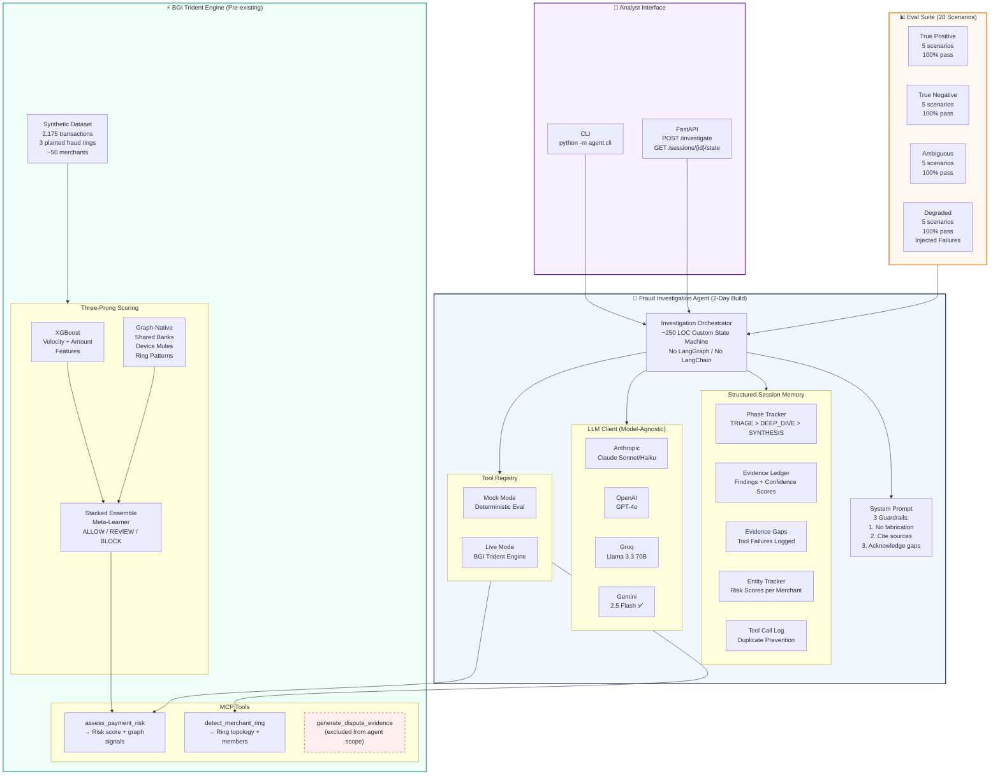
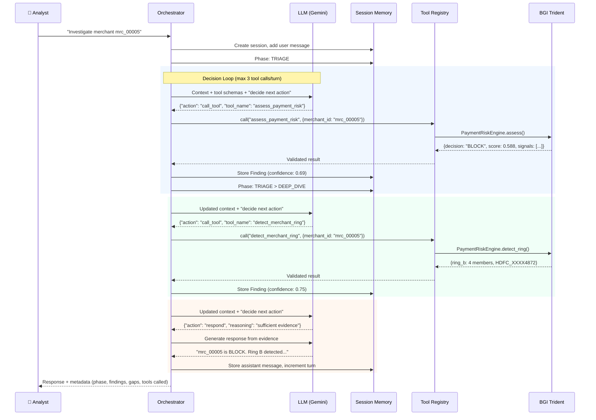
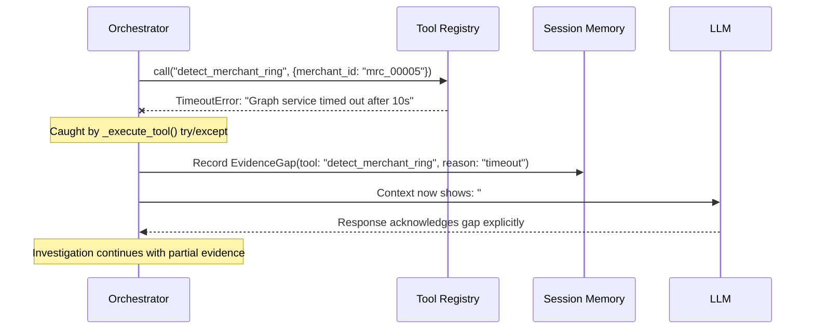
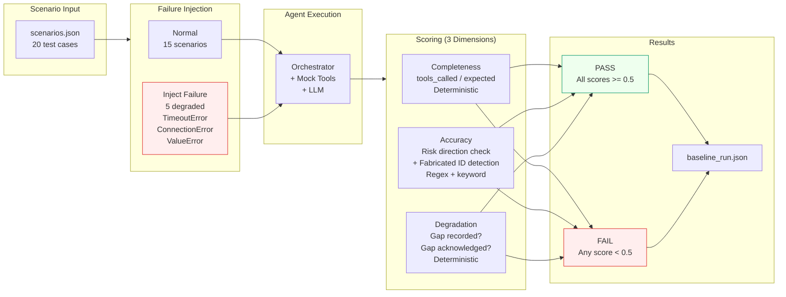

# System Architecture

## Full System: Fraud Investigation Agent + BGI Trident

```mermaid
flowchart TB
    subgraph ANALYST["👤 Analyst Interface"]
        CLI["CLI\npython -m agent.cli"]
        API["FastAPI\nPOST /investigate\nGET /sessions/{id}/state"]
    end

    subgraph AGENT["🤖 Fraud Investigation Agent (2-Day Build)"]
        direction TB

        ORCH["Investigation Orchestrator\n~250 LOC Custom State Machine\nNo LangGraph / No LangChain"]

        subgraph MEMORY["Structured Session Memory"]
            direction LR
            PHASE["Phase Tracker\nTRIAGE > DEEP_DIVE > SYNTHESIS"]
            FINDINGS["Evidence Ledger\nFindings + Confidence Scores"]
            GAPS["Evidence Gaps\nTool Failures Logged"]
            ENTITIES["Entity Tracker\nRisk Scores per Merchant"]
            TOOLLOG["Tool Call Log\nDuplicate Prevention"]
        end

        subgraph LLM_LAYER["LLM Client (Model-Agnostic)"]
            direction LR
            ANTHROPIC["Anthropic\nClaude Sonnet/Haiku"]
            OPENAI["OpenAI\nGPT-4o"]
            GROQ["Groq\nLlama 3.3 70B"]
            GEMINI["Gemini\n2.5 Flash ✅"]
        end

        subgraph TOOLS["Tool Registry"]
            direction LR
            MOCK["Mock Mode\nDeterministic Eval"]
            LIVE["Live Mode\nBGI Trident Engine"]
        end

        PROMPTS["System Prompt\n3 Guardrails:\n1. No fabrication\n2. Cite sources\n3. Acknowledge gaps"]
    end

    subgraph EVAL["📊 Eval Suite (20 Scenarios)"]
        direction LR
        TP["True Positive\n5 scenarios\n100% pass"]
        TN["True Negative\n5 scenarios\n100% pass"]
        AM["Ambiguous\n5 scenarios\n100% pass"]
        DG["Degraded\n5 scenarios\n100% pass\nInjected Failures"]
    end

    subgraph TRIDENT["⚡ BGI Trident Engine (Pre-existing)"]
        direction TB

        subgraph SCORING["Three-Prong Scoring"]
            direction LR
            XGBOOST["XGBoost\nVelocity + Amount\nFeatures"]
            GRAPH["Graph-Native\nShared Banks\nDevice Mules\nRing Patterns"]
            ENSEMBLE["Stacked Ensemble\nMeta-Learner\nALLOW / REVIEW / BLOCK"]
        end

        subgraph MCP_TOOLS["MCP Tools"]
            direction LR
            T1["assess_payment_risk\n→ Risk score + graph signals"]
            T2["detect_merchant_ring\n→ Ring topology + members"]
            T3["generate_dispute_evidence\n(excluded from agent scope)"]
        end

        DATA["Synthetic Dataset\n2,175 transactions\n3 planted fraud rings\n~50 merchants"]
    end

    CLI --> ORCH
    API --> ORCH
    ORCH --> LLM_LAYER
    ORCH --> MEMORY
    ORCH --> TOOLS
    ORCH --> PROMPTS
    TOOLS --> T1
    TOOLS --> T2
    XGBOOST --> ENSEMBLE
    GRAPH --> ENSEMBLE
    ENSEMBLE --> T1
    DATA --> SCORING
    EVAL --> ORCH

    style AGENT fill:#f0f7ff,stroke:#1B2A4A,stroke-width:2px
    style TRIDENT fill:#f0fff7,stroke:#2A9D8F,stroke-width:2px
    style EVAL fill:#fff7f0,stroke:#D97706,stroke-width:2px
    style ANALYST fill:#f7f0ff,stroke:#6B21A8,stroke-width:2px
    style T3 fill:#fee,stroke:#DC2626,stroke-dasharray: 5 5
```

## Investigation Flow (Single Session)

```mermaid
sequenceDiagram
    participant A as 👤 Analyst
    participant O as Orchestrator
    participant L as LLM (Gemini)
    participant M as Session Memory
    participant T as Tool Registry
    participant E as BGI Trident

    A->>O: "Investigate merchant mrc_00005"
    O->>M: Create session, add user message
    O->>M: Phase: TRIAGE

    rect rgb(240, 247, 255)
        Note over O,L: Decision Loop (max 3 tool calls/turn)
        O->>L: Context + tool schemas + "decide next action"
        L-->>O: {"action": "call_tool", "tool_name": "assess_payment_risk"}
        O->>T: call("assess_payment_risk", {merchant_id: "mrc_00005"})
        T->>E: PaymentRiskEngine.assess()
        E-->>T: {decision: "BLOCK", score: 0.588, signals: [...]}
        T-->>O: Validated result
        O->>M: Store Finding (confidence: 0.69)
        O->>M: Phase: TRIAGE > DEEP_DIVE
    end

    rect rgb(240, 255, 247)
        O->>L: Updated context + "decide next action"
        L-->>O: {"action": "call_tool", "tool_name": "detect_merchant_ring"}
        O->>T: call("detect_merchant_ring", {merchant_id: "mrc_00005"})
        T->>E: PaymentRiskEngine.detect_ring()
        E-->>T: {ring_b: 4 members, HDFC_XXXX4872}
        T-->>O: Validated result
        O->>M: Store Finding (confidence: 0.75)
    end

    rect rgb(255, 247, 240)
        O->>L: Updated context + "decide next action"
        L-->>O: {"action": "respond", "reasoning": "sufficient evidence"}
        O->>L: Generate response from evidence
        L-->>O: "mrc_00005 is BLOCK. Ring B detected..."
        O->>M: Store assistant message, increment turn
    end

    O-->>A: Response + metadata (phase, findings, gaps, tools called)
```

## Tool Failure / Graceful Degradation Flow

```mermaid
sequenceDiagram
    participant O as Orchestrator
    participant T as Tool Registry
    participant M as Session Memory
    participant L as LLM

    O->>T: call("detect_merchant_ring", {merchant_id: "mrc_00005"})
    T--xO: TimeoutError: "Graph service timed out after 10s"

    Note over O: Caught by _execute_tool() try/except
    O->>M: Record EvidenceGap(tool: "detect_merchant_ring", reason: "timeout")
    O->>L: Context now shows: "### Evidence Gaps (1)\n  [GAP] detect_merchant_ring: timeout"
    L-->>O: Response acknowledges gap explicitly
    Note over O: Investigation continues with partial evidence
```

## Eval Scoring Pipeline

```mermaid
flowchart LR
    subgraph INPUT["Scenario Input"]
        S["scenarios.json\n20 test cases"]
    end

    subgraph INJECT["Failure Injection"]
        NORMAL["Normal\n15 scenarios"]
        FAIL["Inject Failure\n5 degraded\nTimeoutError\nConnectionError\nValueError"]
    end

    subgraph RUN["Agent Execution"]
        AGENT["Orchestrator\n+ Mock Tools\n+ LLM"]
    end

    subgraph SCORE["Scoring (3 Dimensions)"]
        COMP["Completeness\ntools_called / expected\nDeterministic"]
        ACC["Accuracy\nRisk direction check\n+ Fabricated ID detection\nRegex + keyword"]
        DEG["Degradation\nGap recorded?\nGap acknowledged?\nDeterministic"]
    end

    subgraph OUTPUT["Results"]
        PASS["PASS\nAll scores >= 0.5"]
        FAILR["FAIL\nAny score < 0.5"]
        JSON["baseline_run.json"]
    end

    S --> INJECT
    NORMAL --> AGENT
    FAIL --> AGENT
    AGENT --> SCORE
    COMP --> PASS
    ACC --> PASS
    DEG --> PASS
    COMP --> FAILR
    ACC --> FAILR
    DEG --> FAILR
    PASS --> JSON
    FAILR --> JSON

    style FAIL fill:#fee,stroke:#DC2626
    style PASS fill:#efe,stroke:#059669
    style FAILR fill:#fee,stroke:#DC2626
```
